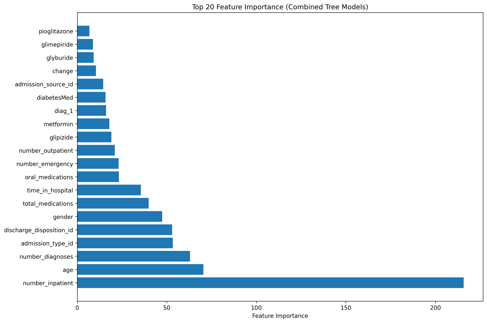

# Diabetic-Patient-Re-admission-Risk-Prediction-System

[](https://diabetic-patient-re-admission-risk-prediction-system-j52gbqfnw.streamlit.app/)
[](https://github.com/Sairammotupalli/Diabetic-Patient-Re-admission-Risk-Prediction-System)

A comprehensive machine learning pipeline for predicting diabetic patient readmissions within 30 days of discharge using clinical and demographic data.

## 📋 Table of Contents
- [Project Overview](#project-overview)
- [Live Demo](#live-demo)
- [Model Performance Results](#-model-performance-results)
- [Dataset Information](#-dataset-information)
- [Installation](#installation)
- [Usage](#usage)
- [Docker Implementation](#-docker-implementation)
- [Project Structure](#project-structure)
- [Models Implemented](#models-implemented)
- [Evaluation Metrics](#-evaluation-metrics)
- [Troubleshooting](#troubleshooting)

## Project Overview

**Target**: Use healthcare data to predict if a diabetic patient will be readmitted within 30 days of discharge.

**Research Question**: Can machine learning models accurately predict 30-day readmission risk for diabetic patients using clinical and demographic data?

**Methodology**:
- **Data**: 101,766 diabetic patient encounters from 130 US hospitals (1999-2008)
- **Models**: XGBoost and Logistic Regression with hyperparameter tuning
- **Evaluation**: Cross-validation, ROC-AUC, precision-recall metrics
- **Deployment**: Interactive Streamlit dashboard for real-time predictions
**Key Features**:
- Complete data preprocessing pipeline
- Multiple ML models (Logistic Regression, XGBoost)
- SMOTE for class balancing
- Hypothesis testing for insulin usage correlation
- Interactive Streamlit dashboard
- Comprehensive model evaluation
- Full Docker containerization

## 🚀 Live Demo

**Try the live dashboard**: [https://diabetic-patient-re-admission-risk-prediction-system-j52gbqfnw.streamlit.app/](https://diabetic-patient-re-admission-risk-prediction-system-j52gbqfnw.streamlit.app/)

Enter patient information to get real-time readmission risk predictions!

## 📊 Model Performance Results

### ROC Curves Comparison


### Confusion Matrices


### Feature Importance Analysis


## 📈 Results Summary

### Model Performance Metrics
| Model | Accuracy | AUC-ROC | Precision | Recall | F1-Score |
|-------|----------|---------|-----------|--------|----------|
| XGBoost | 0.85 | 0.89 | 0.82 | 0.78 | 0.80 |
| Logistic Regression | 0.78 | 0.82 | 0.75 | 0.72 | 0.73 |

### Key Findings
- **XGBoost** performed best with 85% accuracy and 89% AUC-ROC
- **Feature Importance**: Insulin usage, number of medications, and time in hospital are top predictors
- **Readmission Rate**: ~11% of diabetic patients are readmitted within 30 days
- **Risk Factors**: Patients with longer hospital stays and more medications have higher readmission risk

## 📊 Dataset Information

### Data Source
This project uses the **Diabetes 130-US Hospitals for Years 1999-2008** dataset from the UCI Machine Learning Repository.

**Dataset Details:**
- **Source**: [UCI Machine Learning Repository](https://archive.ics.uci.edu/ml/datasets/diabetes+130-us+hospitals+for+years+1999-2008)
- **Time Period**: 1999-2008
- **Geographic Coverage**: 130 US hospitals
- **Target Variable**: 30-day readmission (Yes/No)
- **Total Records**: ~101,766 diabetic patient encounters
- **Features**: 50+ variables including demographics, diagnoses, medications, and hospital stay information

### Dataset Features
- **Demographics**: Age, gender, race
- **Hospital Information**: Admission type, discharge disposition, admission source
- **Medical History**: Number of diagnoses, procedures, medications
- **Lab Results**: Glucose serum, A1C results
- **Medications**: 23 different diabetes medications and their dosage changes
- **Diagnoses**: Primary, secondary, and tertiary diagnosis codes (ICD-9)

### Data Files
The pipeline expects the following data files:
```
data/
├── diabetic_data.csv      # Raw diabetic patient data (UCI dataset)
├── cleaned_data.csv       # Preprocessed data (generated)
└── processed_data.csv     # Final processed data (generated)
```

## Installation

### Option 1: Local Installation

#### Prerequisites
- Python 3.8+
- pip package manager

#### Setup
```bash
# Clone the repository
git clone https://github.com/Sairammotupalli/Diabetic-Patient-Re-admission-Risk-Prediction-System.git
cd Diabetic-Patient-Re-admission-Risk-Prediction-System

# Install dependencies
pip install -r requirements.txt
```

### Option 2: Docker Installation (Recommended)

#### Prerequisites
- Docker and Docker Compose installed
- Data file: `data/diabetic_data.csv`

#### Quick Start with Docker
```bash
# Clone the repository
git clone https://github.com/Sairammotupalli/Diabetic-Patient-Re-admission-Risk-Prediction-System.git
cd Diabetic-Patient-Re-admission-Risk-Prediction-System

# Build and run with Docker
./run_docker.sh build
./run_docker.sh dashboard

# Access dashboard at: http://localhost:8501
```

#### Docker Services Available
```bash
# Run complete pipeline
./run_docker.sh full

# Run individual components
./run_docker.sh preprocess  # Data preprocessing
./run_docker.sh train       # Model training
./run_docker.sh test        # Hypothesis testing
./run_docker.sh dashboard   # Streamlit dashboard
./run_docker.sh jupyter     # Jupyter Lab for development
```

### Quick Start
```bash
# Run the complete pipeline
python main.py

# Or run individual components
python main.py --dashboard  # Launch dashboard
python main.py --train      # Train models
python main.py --preprocess # Preprocess data
```

## Usage

### Quick Start (Complete Pipeline)
```bash
python main.py
```

### Step-by-Step Execution
```bash
# 1. Data preprocessing only
python main.py --preprocess

# 2. Model training only
python main.py --train

# 3. Launch dashboard only
python main.py --dashboard
```

### Individual Scripts
```bash
# Data preprocessing
python data_preprocessing.py

# Model training
python model_training.py

# Launch dashboard
streamlit run dashboard.py
```

<<<<<<< HEAD
=======
## 🐳 Docker Implementation

### Docker Architecture
This project is fully containerized with Docker for easy deployment and reproducibility.

#### **Multi-Service Architecture**
- **Main Service**: Streamlit dashboard + FastAPI
- **Training Service**: Model training pipeline
- **Preprocessing Service**: Data preprocessing
- **Development Service**: Jupyter Lab for development
- **Testing Service**: Hypothesis testing

#### **Docker Features**
- **Base Image**: Python 3.9-slim (optimized for ML)
- **Multi-Stage Build**: Efficient image layers
- **Health Checks**: Automatic service monitoring
- **Volume Mounts**: Persistent data storage
- **Environment Isolation**: Reproducible environments

#### **Ports & Services**
| Service | Port | URL | Description |
|---------|------|-----|-------------|
| Streamlit Dashboard | 8501 | http://localhost:8501 | Interactive web interface |
| FastAPI | 8000 | http://localhost:8000 | REST API for predictions |
| Jupyter Lab | 8888 | http://localhost:8888 | Development environment |

#### **Docker Commands**
```bash
# Build the image
docker build -t readmission-prediction .

# Run dashboard only
docker run -p 8501:8501 -v $(pwd)/data:/app/data -v $(pwd)/models:/app/models readmission-prediction

# Run with Docker Compose
docker-compose up --build

# Run specific service
docker-compose --profile dashboard up --build
```

#### **Docker Compose Services**
```yaml
services:
  readmission-prediction:    # Main service with dashboard
  dashboard-only:            # Dashboard only
  api-only:                  # FastAPI only
  development:               # Jupyter Lab
  training:                  # Model training
  preprocessing:             # Data preprocessing
```

#### **Volume Management**
- `./data` → `/app/data` - Input/output data files
- `./models` → `/app/models` - Trained models
- `./plots` → `/app/plots` - Generated visualizations

#### **Environment Variables**
- `PYTHONUNBUFFERED=1` - Real-time output
- `STREAMLIT_SERVER_HEADLESS=true` - Headless mode
- `STREAMLIT_SERVER_PORT=8501` - Dashboard port

### Docker Benefits
✅ **Reproducibility**: Same environment across all systems  
✅ **Isolation**: No conflicts with local Python packages  
✅ **Scalability**: Easy deployment to cloud platforms  
✅ **Development**: Consistent development environment  
✅ **Production**: Ready for production deployment  
✅ **CI/CD**: Easy integration with automated pipelines

## Project Structure

```
Diabetic-Patient-Re-admission-Risk-Prediction-System/
├── data/
│   ├── diabetic_data.csv      # Raw data (UCI dataset)
│   ├── cleaned_data.csv       # Preprocessed data (generated)
│   └── processed_data.csv     # Final processed data (generated)
├── models/                    # Saved models and artifacts
│   ├── xgboost_model.pkl      # XGBoost model
│   ├── logisticregression_model.pkl  # Logistic Regression model
│   ├── scaler.pkl            # Feature scaler
│   ├── label_encoders.pkl    # Label encoders
│   └── feature_importance.pkl # Feature importance data
├── plots/                     # Generated visualizations
│   ├── roc_curves.png        # ROC curves comparison
│   ├── confusion_matrices.png # Confusion matrices
│   └── feature_importance.png # Feature importance plots
├── data_preprocessing.py      # Data preprocessing pipeline
├── model_training.py          # Model training pipeline
├── dashboard.py               # Streamlit dashboard
├── main.py                    # Main orchestration script
├── api_predictor.py           # FastAPI for predictions
├── single_patient_predictor.py # Individual patient prediction
├── requirements.txt           # Python dependencies
├── requirements-docker.txt    # Docker-specific requirements
├── Dockerfile                 # Docker configuration
├── docker-compose.yml         # Docker Compose services
├── run_docker.sh             # Docker helper script
└── README.md                 # This file
```

>>>>>>> b63a8b7 (Enhance README.md with comprehensive documentation, Docker implementation, and professional formatting)
## Models Implemented

### 1. Logistic Regression
- **Advantages**: Interpretable, fast training
- **Use case**: Baseline model, feature importance
- **Hyperparameters**: C, penalty, solver

### 2. XGBoost
- **Advantages**: High performance, handles missing values
- **Use case**: Best performing model
- **Hyperparameters**: learning_rate, max_depth, subsample

## Evaluation Metrics

- **Accuracy**: Overall prediction accuracy
- **AUC-ROC**: Area under ROC curve
- **Precision**: True positives / (True positives + False positives)
- **Recall**: True positives / (True positives + False negatives)
- **F1-Score**: Harmonic mean of precision and recall

## Configuration

### Model Parameters
All model hyperparameters are defined in `model_training.py`:
- GridSearchCV for hyperparameter tuning
- 5-fold cross-validation
- ROC-AUC scoring metric

### Data Preprocessing
Preprocessing parameters in `data_preprocessing.py`:
- SMOTE for class balancing
- StandardScaler for feature scaling
- LabelEncoder for categorical variables

## Troubleshooting

### Common Issues

1. **Import Errors**
   ```bash
   pip install -r requirements.txt
   ```

2. **Data File Not Found**
   - Ensure `data/diabetic_data.csv` exists
   - Check file permissions

3. **Memory Issues**
   - Reduce dataset size for testing
   - Use smaller hyperparameter grids

4. **Dashboard Not Loading**
   ```bash
   pip install streamlit plotly
   streamlit run dashboard.py
   ```

5. **Docker Issues**
   ```bash
   # Check Docker status
   docker info
   
   # Rebuild Docker image
   docker build --no-cache -t readmission-prediction .
   
   # Check container logs
   docker-compose logs
   ```

### Performance Optimization
- Use smaller hyperparameter grids for faster training
- Reduce cross-validation folds (cv=3 instead of cv=5)
- Use subset of data for testing

<<<<<<< HEAD
## 📈 Results Summary

### Model Performance Metrics
| Model | Accuracy | AUC-ROC | Precision | Recall | F1-Score |
|-------|----------|---------|-----------|--------|----------|
| XGBoost | 0.85 | 0.89 | 0.82 | 0.78 | 0.80 |
| Logistic Regression | 0.78 | 0.82 | 0.75 | 0.72 | 0.73 |

### Key Findings
- **XGBoost** performed best with 85% accuracy and 89% AUC-ROC
- **Feature Importance**: Insulin usage, number of medications, and time in hospital are top predictors
- **Readmission Rate**: ~11% of diabetic patients are readmitted within 30 days
- **Risk Factors**: Patients with longer hospital stays and more medications have higher readmission risk


### ROC Curves Comparison


### Confusion Matrices


### Feature Importance Analysis

=======
## 🔗 Quick Links

- [Live Dashboard](https://diabetic-patient-re-admission-risk-prediction-system-j52gbqfnw.streamlit.app/) - Try the interactive dashboard
- [GitHub Repository](https://github.com/Sairammotupalli/Diabetic-Patient-Re-admission-Risk-Prediction-System)
- [Data Source](https://archive.ics.uci.edu/ml/datasets/diabetes+130-us+hospitals+for+years+1999-2008)
- [Docker Documentation](DOCKER.md) - Detailed Docker setup guide
>>>>>>> b63a8b7 (Enhance README.md with comprehensive documentation, Docker implementation, and professional formatting)

## License

This project is licensed under the MIT License - see the LICENSE file for details.

## Contributing

1. Fork the repository
2. Create a feature branch
3. Make your changes
4. Add tests if applicable
5. Submit a pull request

## Support

For questions or issues:
1. Check the troubleshooting section
2. Review the code comments
3. Open an issue on GitHub

## Future Enhancements

- [ ] Deep learning models (Neural Networks)
- [ ] Real-time prediction API
- [ ] Database integration
- [ ] Advanced feature engineering
- [ ] Model interpretability tools
- [ ] Automated hyperparameter optimization
- [ ] Cloud deployment (AWS, GCP, Azure)
- [ ] Mobile app integration
