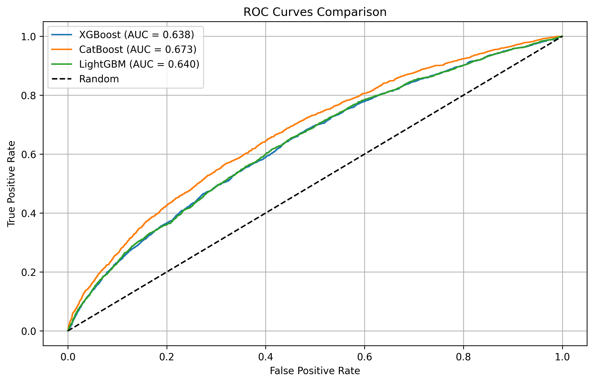

# Diabetic-Patient-Re-admission-Risk-Prediction-System [Get Link](https://diabetic-patient-re-admission-risk-prediction-system-j52gbqfnw.streamlit.app/)

A comprehensive machine learning pipeline for predicting diabetic patient readmissions within 30 days of discharge.

## Project Overview

**Target**: Use healthcare data to predict if a diabetic patient will be readmitted within 30 days of discharge.

**Key Features**:
- Complete data preprocessing pipeline
- Multiple ML models (Logistic Regression, XGBoost)
- SMOTE for class balancing
- Hypothesis testing for insulin usage correlation
- Interactive Streamlit dashboard
- Comprehensive model evaluation

## Pipeline Steps

### 1. Data Loading & Preprocessing
- **Data Loading**: Load diabetic patient dataset
- **Missing Value Imputation**: Handle missing values using mode/median
- **Category Consolidation**: Consolidate medications and diagnosis codes
- **Label Encoding**: Encode categorical variables

### 2. Model Training
- **Logistic Regression**: Linear model with regularization
- **Random Forest Classifier**: Ensemble tree-based model
- **XGBoost**: Gradient boosting with hyperparameter tuning
- **ML Pipeline**: Using scikit-learn Pipelines + GridSearchCV

### 3. Model Evaluation
- **ROC Curves**: Model performance comparison
- **Confusion Matrices**: Detailed classification metrics
- **Feature Importance**: Identify key predictors
- **Cross-validation**: Robust model assessment

### 4. Interactive Dashboard
- **Feature Importance Charts**: Bar charts of key predictors
- **Readmission Distributions**: By diagnosis, age, gender
- **ROC Curves**: Model performance visualization
- **Confusion Matrices**: Detailed model evaluation

## Installation

### Prerequisites
- Python 3.8+
- pip package manager

### Setup
```bash
# Clone the repository
git clone https://github.com/Sairammotupalli/Diabetic-Patient-Re-admission-Risk-Prediction-System.git
cd Readmission_Prediction

# Install dependencies
pip install -r requirements.txt
```

## Data

The pipeline expects the following data files:
```
data/
├── diabetic_data.csv      # Raw diabetic patient data
├── cleaned_data.csv       # Preprocessed data (generated)
└── processed_data.csv     # Final processed data (generated)
```

## Usage

### Quick Start (Complete Pipeline)
```bash
python main.py
```

### Step-by-Step Execution
```bash
# 1. Data preprocessing only
python main.py --preprocess

# 2. Model training only
python main.py --train

# 3. Launch dashboard only
python main.py --dashboard
```

### Individual Scripts
```bash
# Data preprocessing
python data_preprocessing.py

# Model training
python model_training.py

# Launch dashboard
streamlit run dashboard.py
```

## Dashboard Features

The interactive Streamlit dashboard includes:

### Overview Page
- Key metrics and insights
- Dataset characteristics
- Model performance summary

### Data Analysis Page
- Readmission distribution
- Age/gender analysis
- Insulin usage patterns
- Medication count analysis

## Models Implemented

### 1. Logistic Regression
- **Advantages**: Interpretable, fast training
- **Use case**: Baseline model, feature importance
- **Hyperparameters**: C, penalty, solver

### 2. XGBoost
- **Advantages**: High performance, handles missing values
- **Use case**: Best performing model
- **Hyperparameters**: learning_rate, max_depth, subsample

##  Evaluation Metrics

- **Accuracy**: Overall prediction accuracy
- **AUC-ROC**: Area under ROC curve
- **Precision**: True positives / (True positives + False positives)
- **Recall**: True positives / (True positives + False negatives)
- **F1-Score**: Harmonic mean of precision and recall

## Configuration

### Model Parameters
All model hyperparameters are defined in `model_training.py`:
- GridSearchCV for hyperparameter tuning
- 5-fold cross-validation
- ROC-AUC scoring metric

### Data Preprocessing
Preprocessing parameters in `data_preprocessing.py`:
- SMOTE for class balancing
- StandardScaler for feature scaling
- LabelEncoder for categorical variables

## Troubleshooting

### Common Issues

1. **Import Errors**
   ```bash
   pip install -r requirements.txt
   ```

2. **Data File Not Found**
   - Ensure `data/diabetic_data.csv` exists
   - Check file permissions

3. **Memory Issues**
   - Reduce dataset size for testing
   - Use smaller hyperparameter grids

4. **Dashboard Not Loading**
   ```bash
   pip install streamlit plotly
   streamlit run dashboard.py
   ```

### Performance Optimization
- Use smaller hyperparameter grids for faster training
- Reduce cross-validation folds (cv=3 instead of cv=5)
- Use subset of data for testing

## Model Performance Results

### ROC Curves Comparison


### Confusion Matrices


### Feature Importance Analysis


## License

This project is licensed under the MIT License - see the LICENSE file for details.
